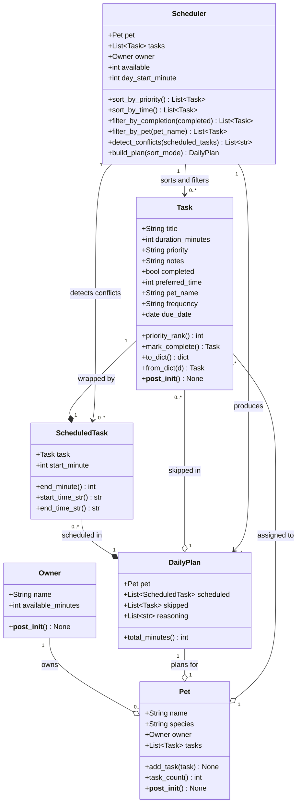

# PawPal+ — UML Class Diagram (Final)

## Relationship key

| Notation | Meaning |
|---|---|
| `--*` | Composition — the child cannot exist without the parent |
| `--o` | Aggregation — the child exists independently and is referenced |
| `-->` | Association — one class uses another directly |

## What changed from Phase 1 to final

| Change | Reason |
|---|---|
| `scheduler` module → `Scheduler` class | Sorting, filtering, and conflict detection required state and multiple methods |
| `Task` gained `completed`, `frequency`, `due_date`, `preferred_time`, `pet_name` | Recurrence, multi-pet support, and time-based sorting required new fields |
| `Task.mark_complete()` returns `Optional[Task]` | Recurring tasks spawn a new instance via `timedelta` |
| `Pet` gained `tasks`, `add_task()`, `task_count()` | Pets now own their personal task lists directly |
| `Scheduler.sort_by_time()` added | Second sort mode using lambda key on `preferred_time` integer |
| `Scheduler.filter_by_completion()` + `filter_by_pet()` added | Non-mutating filter methods for UI task list display |
| `Scheduler.detect_conflicts()` added | Lightweight O(n²) overlap check returning plain-English warning strings |
| Module-level `build_plan()` kept as thin wrapper | Backwards compatibility — `app.py` and tests import it unchanged |
